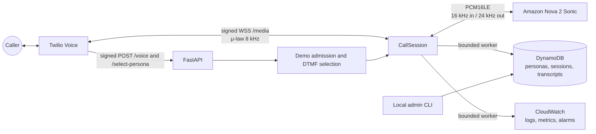

# Real-Time Voice Agent

A production-minded Python service that connects a live Twilio phone call to Amazon Nova 2 Sonic over a full-duplex audio stream. It handles telephony authentication, stateful audio conversion, model streaming, interruption, session continuation, DynamoDB persistence, and CloudWatch telemetry without blocking the media path.

## What it demonstrates

- **Real-time bidirectional audio:** Twilio G.711 μ-law at 8 kHz ↔ Nova PCM16LE at 16/24 kHz.
- **Per-call isolation:** one `CallSession` owns stream IDs, resamplers, bounded queues, tasks, persistence ordering, and cleanup.
- **Configurable domain personas:** versioned prompts and voices live in DynamoDB; a JSON catalog imports multiple personas without a deployment.
- **Safe inbound public demo:** one Twilio number presents a four-persona DTMF menu, spoken privacy warning, rate/capacity/budget admission, and a five-minute duration limit.
- **Conversation lifecycle:** session outcomes and aggregate turn counts persist with deterministic ordering and TTL retention; public-demo transcript text defaults off.
- **Operational controls:** structured redacted logs, low-cardinality metrics, alarms, a reliability dashboard, and bounded background workers.
- **Security at the edge:** Twilio signatures, Account SID, media format, and opaque demo reservations are validated before backend access.
- **Resilient streaming:** barge-in clears stale playback; long calls rotate Nova sessions while retaining bounded conversation history.



**Tech stack:** Python 3.12, FastAPI, Uvicorn, Twilio Media Streams, Amazon Bedrock Nova 2 Sonic, DynamoDB, CloudWatch, AWS CDK, ECS/Fargate, CloudFront, pytest, Ruff, mypy, and `uv`.

## Quick start

```bash
# macOS system dependency used by the standalone microphone/speaker smoke test
brew install portaudio

uv python install 3.12
uv sync --all-groups --frozen
cp .env.example .env
```

Set these values in the ignored `.env`:

```dotenv
AWS_REGION=YOUR_NOVA_SUPPORTED_REGION
TWILIO_ACCOUNT_SID=YOUR_TWILIO_ACCOUNT_SID
TWILIO_AUTH_TOKEN=YOUR_TWILIO_AUTH_TOKEN
PUBLIC_BASE_URL=https://YOUR_PUBLIC_HOST
PUBLIC_MEDIA_WS_URL=wss://YOUR_PUBLIC_HOST/media
DEMO_MODE_ENABLED=true
DEMO_MAX_CALL_DURATION_SECONDS=300
DEMO_PERSIST_TRANSCRIPTS=false
```

Use the AWS credential provider chain; do not put AWS keys in `.env`. Then bootstrap the data model and personas:

```bash
uv run python scripts/admin.py tables ensure
uv run python scripts/admin.py personas import --file config/personas.example.json
uv run python scripts/admin.py personas list
uv run python scripts/admin.py personas activate care-coordinator --expected-version 1
```

Run the service and expose it through a TLS-capable public endpoint such as ngrok:

```bash
uv run uvicorn realtime_voice_agent.main:app --app-dir src --host 0.0.0.0 --port 8000
ngrok http 8000
```

Configure one voice-capable Twilio number's incoming webhook as `POST https://YOUR_PUBLIC_HOST/voice`. Demo mode speaks the safety disclaimer and presents the configured persona menu before returning `<Connect><Stream>` for `wss://YOUR_PUBLIC_HOST/media`. This service has no outbound-call path.

## Public demo flow

1. Twilio signs `POST /voice`. The application validates the exact public URL, HMACs and discards the caller/call identifiers, applies the rolling caller limit, then checks global capacity and call-start budget.
2. The caller hears the portfolio/privacy disclaimer and presses one digit for Care Coordinator, Financial Services Assistant, Travel Concierge, or History Guide.
3. Signed `POST /select-persona` maps the digit to a configured persona ID, reloads its current version from DynamoDB, and reserves one short-lived global slot.
4. Twilio receives `<Connect><Stream>` with only an opaque reservation parameter. Persona IDs and prompts are not placed in the media URL.
5. `/media` validates the WebSocket signature, Account SID, fixed μ-law format, reservation, and selected persona version before persistence or Nova starts.
6. The selected persona snapshot enters the same `CallSession`, codec, Nova, persistence, and telemetry pipeline used by the non-demo path.
7. The duration guard performs bounded idempotent cleanup after `DEMO_MAX_CALL_DURATION_SECONDS`; the default is five minutes.
8. Capacity, rolling budget, and caller-rate rejection paths speak a short message and hang up without opening Nova.

The controls are application-level cost bounds, not billing guarantees. Twilio begins charging before the webhook runs. Configure Twilio Usage Triggers, balance alerts, geographic permissions, and AWS Budgets separately.

See [`docs/architecture.md`](docs/architecture.md) for component boundaries, state machines, persistence schemas, failure behavior, and design rationale.

## Persona configuration

The runtime contains no domain-specific prompt branching. Demo mode maps DTMF digits to persona IDs through `DEMO_PERSONA_CHOICES`, then loads the selected DynamoDB persona and snapshots:

```text
persona_id + name + system_prompt + voice_id + version
```

When demo mode is disabled, calls continue to use the active-persona pointer.

[`config/personas.example.json`](config/personas.example.json) includes:

- Care Coordinator
- Financial Services Assistant
- Travel Concierge
- History Guide

Importing a catalog is idempotent for unchanged entries. Changed entries use the stored version as the optimistic-concurrency precondition and create a new version. Activation is explicit:

```bash
uv run python scripts/admin.py personas import --file config/personas.example.json
uv run python scripts/admin.py personas activate travel-concierge --expected-version 1
uv run python scripts/admin.py personas get travel-concierge
```

Create or update a single persona from a prompt file when a catalog is unnecessary:

```bash
uv run python scripts/admin.py personas put support-assistant \
  --name "Support Assistant" \
  --voice-id matthew \
  --prompt-file ./prompt.txt \
  --expected-version 0
```

The voice ID must be supported by Nova 2 Sonic in the selected Region.

## Configuration

`.env.example` contains non-secret defaults and blank credential placeholders. Important groups:

| Group | Variables |
| --- | --- |
| Runtime | `APP_ENV`, `LOG_LEVEL`, `SERVICE_NAME` |
| AWS/Nova | `AWS_PROFILE`, `AWS_REGION`, `NOVA_MODEL_ID`, `NOVA_VOICE_ID`, sample rates, chunk size, rotation interval |
| Twilio | `TWILIO_ACCOUNT_SID`, `TWILIO_AUTH_TOKEN`, `TWILIO_VALIDATE_SIGNATURES`, public HTTPS/WSS URLs |
| Public demo | mode flag, DTMF-to-persona mapping, duration, caller window, global concurrency, rolling call budget, reservation TTL, transcript persistence |
| DynamoDB | persona/session/transcript table names, retention, persistence queue and retry limits |
| CloudWatch | enable flag, log group/stream, metric namespace, telemetry queue and retry limits |
| Backpressure | malformed-frame limit, inbound/outbound audio bounds, cleanup timeouts |

Configuration is validated before paid model streaming. `STORE_PHONE_NUMBERS=true` is rejected; the current persistence contract deliberately does not store phone numbers.

## AWS and Twilio setup

### AWS

The selected identity needs the minimum actions for the enabled path:

- `bedrock:InvokeModelWithBidirectionalStream` for `amazon.nova-2-sonic-v1:0`
- DynamoDB table administration for bootstrap, then item/query operations for runtime
- CloudWatch Logs and `cloudwatch:PutMetricData` when CloudWatch publishing is enabled
- CloudWatch alarm/dashboard administration only for the observability bootstrap command

Confirm the model is available in the selected Region. The application uses the standard AWS credential provider chain and never reads raw AWS access keys from application settings.

Run a direct Nova microphone/speaker check independently of Twilio:

```bash
uv run python scripts/nova_smoke.py --timeout-seconds 120
```

### Twilio

- Attach exactly one inbound voice-capable number to `POST https://YOUR_PUBLIC_HOST/voice`.
- Do not configure or grant an outbound-calling path; this application contains no Twilio REST caller.
- Keep `TWILIO_VALIDATE_SIGNATURES=true`.
- Set `PUBLIC_MEDIA_WS_URL` to the exact URL placed in TwiML. Signature validation is URL-sensitive.
- Reconfigure both public URLs whenever a temporary tunnel hostname changes.
- Add Twilio Usage Triggers, balance alerts, and restrictive geographic permissions; application limits cannot prevent the initial PSTN charge.

## Health and readiness

```bash
curl -i http://127.0.0.1:8000/health
curl -i http://127.0.0.1:8000/ready
uv run python scripts/admin.py preflight
```

- `/health` is dependency-free process liveness.
- `/ready` and `admin.py preflight` share the same bounded, read-only AWS readiness service.
- Readiness checks AWS identity safety, DynamoDB table/index/TTL contracts, and the active persona. It does not invoke Nova or start a call.

## Persistence and transcript retrieval

Three DynamoDB tables separate access patterns:

- `RealtimeVoiceAgentPersonas`: versioned persona records plus one active-persona pointer.
- `RealtimeVoiceAgentSessions`: lifecycle metadata keyed by application session ID, with `CallSidIndex` for Twilio call lookup.
- `RealtimeVoiceAgentTranscriptTurns`: FINAL turns keyed by session ID and numeric turn number.

The default TTL is seven days. Retrieve a transcript locally rather than exposing a public administration endpoint:

With the default `DEMO_PERSIST_TRANSCRIPTS=false`, public-demo sessions retain lifecycle metadata, selected persona version, outcomes, and aggregate turn counts but do not write transcript-content rows. The disclaimer still instructs callers not to provide sensitive information.

```bash
uv run python scripts/admin.py transcripts get --session-id SESSION_ID
uv run python scripts/admin.py transcripts get --call-sid TWILIO_CALL_SID
```

## Observability

Local logs are newline-delimited JSON. The sanitizer recursively redacts auth material, credentials, phone fields, prompts, raw audio, and transcript text. Twilio identifiers are hashed before logging.

Enable CloudWatch in `.env`, then create/update the log group, alarms, and dashboard:

```bash
CLOUDWATCH_ENABLED=true
CLOUDWATCH_LOG_GROUP=/realtime-voice-agent/application
CLOUDWATCH_METRIC_NAMESPACE=RealtimeVoiceAgent/VoiceAgent
uv run python scripts/observability.py bootstrap
```

Metrics use only bounded `Environment`, `Component`, and optional `Outcome` dimensions. Call, session, stream, phone, and persona identifiers are intentionally excluded from metric dimensions.

## Deployment

Local Uvicorn plus a TLS tunnel is the shortest path for development. The optional CDK deployment uses exactly one ECS/Fargate task behind an Application Load Balancer and CloudFront, with Secrets Manager credentials, least-privilege task permissions, and non-root container execution. The single-task invariant makes the in-process concurrency and budget limits global; task autoscaling is intentionally disabled until a shared atomic lease store exists.

```bash
uv run cdk synth -c environment=deployment
```

For a deployment with an existing Twilio secret:

```bash
uv run cdk synth \
  -c environment=deployment \
  -c twilioSecretName=YOUR_SECRET_NAME
```

Review synthesized resources and costs before deployment.

## Quality gates

The GitHub Actions workflow runs the same checks as local development:

```bash
uv lock --check
uv sync --all-groups --frozen
uv run ruff format --check .
uv run ruff check .
uv run mypy src
uv run pytest
```

The suite covers audio conversion, protocol parsing, signature rejection, lifecycle transitions, cleanup races, backpressure, persistence ordering and retries, persona import/versioning, observability redaction/cardinality, readiness, concurrency isolation, continuation, and synthesized infrastructure controls.

## Repository layout

```text
config/personas.example.json       example domain persona catalog
docs/architecture.md               design and operational rationale
scripts/admin.py                    local persona/table/transcript CLI
scripts/nova_smoke.py               direct Nova audio smoke test
scripts/observability.py            CloudWatch bootstrap CLI
src/realtime_voice_agent/
  admin/                            local administration
  audio/                            μ-law/PCM conversion and resampling
  demo.py                           public-demo rate, capacity, budget, and lease controller
  deployment/                       AWS CDK application and stack
  nova/                             protocol, SDK transport, continuation
  observability/                    logging, metrics, CloudWatch workers
  persistence/                      DynamoDB models, ports, implementation
  telephony/                        Twilio events, webhook, CallSession
  config.py                         validated environment boundary
  main.py                           FastAPI composition root
  readiness.py                      bounded dependency checks
tests/unit/                         deterministic behavioral tests
```

## Security and privacy posture

- No AWS keys, Twilio credentials, phone numbers, real call IDs, raw audio, or transcripts belong in Git.
- `/voice`, `/select-persona`, and `/media` fail closed on invalid signatures.
- Media format, Account SID, opaque reservation, and selected persona version are validated before model or persistence work.
- Caller phone/call values become HMAC keys in memory and are never logged or persisted.
- Demo transcript-content persistence defaults off.
- Blocking DynamoDB and CloudWatch calls are kept out of per-frame loops.
- Every queue, reservation, duration, retry, and cleanup wait is bounded.
- Raw audio and transcript text are not logged by default.
- Administration and transcript retrieval remain local-only.
- This project is not a compliance certification and should not be used for production regulated data without a separate threat model, controls review, and operational program.

## References

- [Amazon Nova 2 Sonic getting started](https://docs.aws.amazon.com/nova/latest/nova2-userguide/sonic-getting-started.html)
- [Bedrock bidirectional streaming API](https://docs.aws.amazon.com/bedrock/latest/APIReference/API_runtime_InvokeModelWithBidirectionalStream.html)
- [Twilio Media Streams WebSocket messages](https://www.twilio.com/docs/voice/media-streams/websocket-messages)
- [Twilio `<Stream>` TwiML](https://www.twilio.com/docs/voice/twiml/stream)
- [FastAPI](https://fastapi.tiangolo.com/)
- [`uv`](https://docs.astral.sh/uv/)
