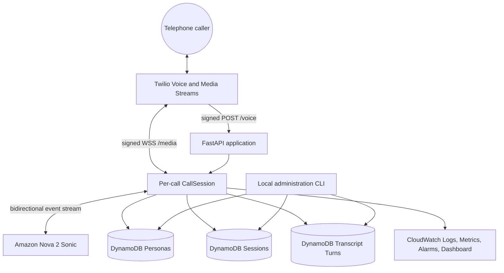
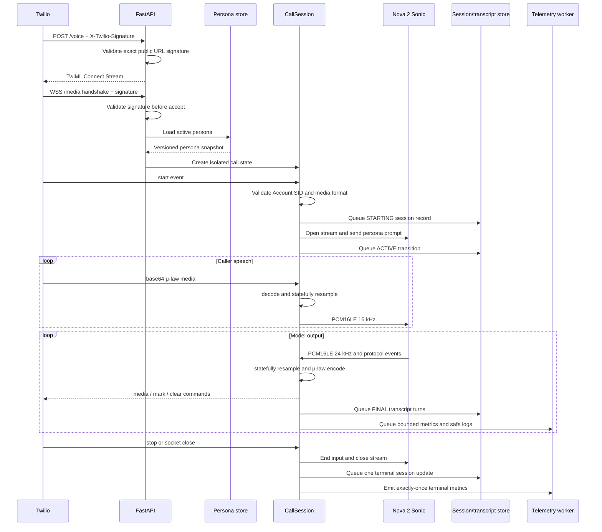
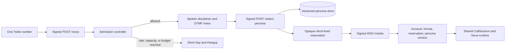
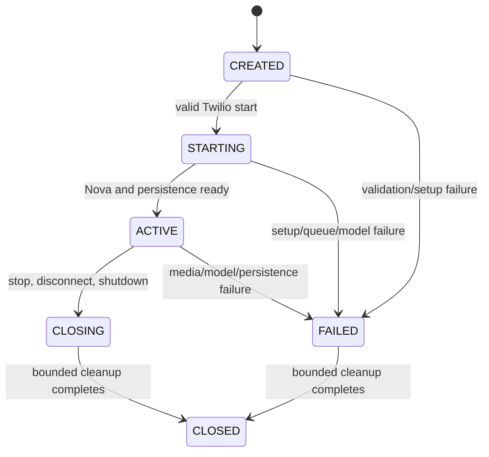

# Real-Time Voice Agent Architecture

## System goals

The service maintains a low-latency, full-duplex voice path between Twilio Media Streams and Amazon Nova 2 Sonic while keeping persistence and telemetry out of the per-frame loop. Its primary invariants are:

1. Authenticate public telephony traffic before accepting media or touching AWS backends.
2. Preserve the exact audio contracts on both external boundaries.
3. Isolate all mutable state by call.
4. Bound memory, latency, retries, and cleanup waits.
5. Persist reproducible persona/session/transcript state without logging sensitive content.
6. Normalize external failures into controlled error and metric categories.

## System context



The application is one asynchronous Python process. The boundaries are modules and typed ports, not networked microservices. This avoids additional serialization and coordination in the audio path while preserving replaceable adapters around Twilio, Nova, DynamoDB, and CloudWatch.

## Component boundaries

| Component | Responsibility | Explicitly does not own |
| --- | --- | --- |
| `main.py` | FastAPI composition, lifespan, routes, WebSocket task orchestration | codec logic, Nova event encoding, DynamoDB schema logic |
| `telephony/webhook.py` | Twilio signature validation and `<Connect><Stream>` TwiML | session state |
| `telephony/events.py` | Parse/serialize typed Twilio events and commands | audio conversion |
| `telephony/session.py` | Per-call state machine, queues, resamplers, task ownership, persistence ordering, cleanup | global call registry, blocking AWS I/O |
| `audio/codecs.py` | raw μ-law/PCM conversion and stateful rate conversion | containers such as WAV or AU |
| `nova/events.py` | Nova event construction, protocol state, output parsing, FINAL transcript assembly | SDK credentials and network transport |
| `nova/aws_transport.py` | experimental AWS SDK adapter and credential resolution | call lifecycle policy |
| `nova/continuation.py` | bounded long-call stream rotation and history handoff | Twilio state |
| `persistence/*` | immutable persistence values, narrow ports, DynamoDB implementation | media processing |
| `observability/*` | sanitization, bounded publishing, fixed metrics, resource bootstrap | transcript or audio storage |
| `readiness.py` | bounded read-only AWS, table, TTL, index, and persona checks | liveness, model invocation |
| `admin/cli.py` | local persona/table/transcript operations and persona-catalog import | public HTTP administration |
| `deployment/*` | optional single-service AWS infrastructure | runtime business logic |

Keeping the experimental `aws-sdk-bedrock-runtime` types inside the Nova adapter is deliberate. SDK and event-shape changes should not propagate into call, telephony, or persistence code.

## Call sequence



## Public demo call entry

Demo mode adds an inbound-only admission layer before the existing media runtime. It does not create persona-specific services or modify the Nova/audio pipeline.



`DEMO_PERSONA_CHOICES` maps DTMF digits to persona IDs. Menu labels and the selected prompt, voice, and version are loaded from the existing persona repository. Application code contains no prompt branches. The selection callback places only an opaque reservation token in Twilio's `<Stream><Parameter>`; it does not expose the persona ID or prompt in the media URL.

The signed `/voice` form supplies `From` and `CallSid`. Both are immediately transformed into domain-separated HMAC keys using the Twilio auth token, then discarded. Admission state retains only those keys, monotonic timestamps, an opaque token, persona ID/version, and expiry.

| Limit | Environment variable | Default | Behavior |
| --- | --- | ---: | --- |
| call duration | `DEMO_MAX_CALL_DURATION_SECONDS` | 300 | closes the session with `DEMO_TIME_LIMIT` after bounded cleanup |
| caller call starts | `DEMO_RATE_LIMIT_MAX_CALLS` | 3 | rolling per-caller limit |
| caller window | `DEMO_RATE_LIMIT_WINDOW_SECONDS` | 3,600 | expires caller HMAC timestamps |
| active and pending calls | `DEMO_GLOBAL_CONCURRENCY_LIMIT` | 2 | rejects before Nova starts |
| call-start budget | `DEMO_BUDGET_MAX_CALLS` | 50 | rolling global start allowance |
| budget window | `DEMO_BUDGET_WINDOW_SECONDS` | 86,400 | expires budget entries |
| reservation lifetime | `DEMO_RESERVATION_TTL_SECONDS` | 30 | recovers abandoned menu capacity |
| transcript content | `DEMO_PERSIST_TRANSCRIPTS` | false | keeps session metadata/turn counts but skips transcript rows |

Pending reservations count against concurrency, so simultaneous selection callbacks cannot oversubscribe Nova. A claimed lease remains active until the media route's `finally` block releases it. The duration guard calls the same idempotent `CallSession.close()` path used by disconnect and shutdown.

Twilio may emit `dtmf` events after the bidirectional stream starts. The parser validates the event shape, discards the pressed digit instead of retaining or logging it, and keeps the active voice session running.

Capacity and budget use the same public response to avoid exposing internal thresholds. Per-caller rejection has a distinct but still bounded message. Every rejection uses `<Say>` followed by `<Hangup>`; no Nova stream or persistence session is created.

There is no outbound-call route, TwiML dial operation, or Twilio REST client. The only telephone entry is an inbound webhook attached to one voice-capable Twilio number.

## Audio contracts

| Stage | Encoding | Rate | Channels | Width | Container |
| --- | --- | ---: | ---: | ---: | --- |
| Twilio inbound payload | G.711 μ-law | 8,000 Hz | 1 | 8-bit companded | none; raw bytes in base64 |
| Decoded inbound | signed PCM | 8,000 Hz | 1 | 16-bit | none |
| Nova input | PCM16LE | 16,000 Hz | 1 | 16-bit | none |
| Nova output | PCM16LE | 24,000 Hz | 1 | 16-bit | none |
| Resampled outbound | signed PCM | 8,000 Hz | 1 | 16-bit | none |
| Twilio outbound payload | G.711 μ-law | 8,000 Hz | 1 | 8-bit companded | none; raw bytes in base64 |

Inbound processing:

```text
base64 decode → μ-law decode → stateful 8 kHz to 16 kHz resample → Nova bytes
```

Outbound processing:

```text
Nova bytes → stateful 24 kHz to 8 kHz resample → μ-law encode → base64 encode
```

Base64 is transport encoding, not audio encoding. No WAV, AU, or other header is introduced. Resampler state remains attached to the call for its lifetime; treating each WebSocket frame as an independent clip would create discontinuities and incorrect boundary behavior.

Python is constrained to 3.12 because this implementation uses `audioop` for μ-law conversion and stateful rate conversion. Python 3.13 removed `audioop`; widening the version requires a replacement codec/resampler and revalidation of chunked conversion, latency, and audio quality.

## Per-call state and concurrency

`CallSession` owns:

- application session ID, Twilio call/stream IDs, and immutable persona snapshot
- lifecycle state and first terminal outcome
- inbound and outbound resampler state
- bounded inbound audio queue
- bounded generation-aware outbound command buffer
- bounded persistence command queue and worker
- Nova transport and continuation state
- transcript turn counter and source-event deduplication
- timestamps, task handles, failure code, and cleanup state

There is no module-level current-call state. Concurrent WebSockets construct independent `CallSession` objects, transports, buffers, and repositories. A failure or queue overflow terminates only its owning call.

### Lifecycle



The first terminal transition wins. Later stop, socket-close, model-error, or shutdown signals reuse idempotent cleanup rather than replacing the recorded outcome.

## Backpressure and non-blocking I/O

| Buffer | Producer | Consumer | Overflow behavior |
| --- | --- | --- | --- |
| inbound audio queue | Twilio reader | Nova input writer | fail the call with `TWILIO_AUDIO_QUEUE_OVERFLOW` |
| outbound command buffer | Nova observer | Twilio WebSocket writer | fail the call instead of accumulating playback latency |
| persistence queue | call coordinator | background DynamoDB worker | fail deterministically with `PERSISTENCE_QUEUE_OVERFLOW` |
| telemetry queue | application/session events | application-level CloudWatch worker | report once locally and drop additional telemetry; do not fail audio |

DynamoDB and CloudWatch clients are synchronous. Calls are dispatched from background workers or through `asyncio.to_thread`; neither runs in a per-frame read/write loop. Queue bounds convert overload into controlled failure instead of unbounded memory growth and ever-increasing conversation delay.

Persistence retries use bounded attempts and delay. Telemetry retries are also bounded, but telemetry failure is intentionally non-fatal to a call. Persistence failure is call-relevant because it compromises the recorded lifecycle/transcript contract.

## Interruption and outbound ordering

Nova interruption events advance a monotonically increasing playback generation. The outbound buffer atomically removes unsent media and marks from older generations, then sends Twilio `clear`. Marks correlate response playback without placing response IDs in metric dimensions.

Generation checks prevent a race in which stale model audio is emitted after the caller has interrupted. Only the active generation can enqueue playback commands.

## Long-call continuation

Nova bidirectional streams have a bounded connection lifetime. The continuation adapter rotates before that limit:

1. Retain only bounded immutable FINAL transcript history.
2. Start a replacement stream with the same persona snapshot and model configuration.
3. Send prior caller/agent text as non-interactive `USER`/`ASSISTANT` history blocks.
4. Hand input/output ownership to the replacement stream atomically.
5. Retire the previous stream with bounded cleanup.

Twilio state, application session identity, resamplers, persistence ordering, and turn counters remain unchanged. Startup and handoff failures are normalized separately so the call can record a precise terminal cause.

## Persona model

Domain behavior is data, not application branching. A persona contains:

| Field | Purpose |
| --- | --- |
| `persona_id` | stable administration identifier |
| `name` | operator-facing label |
| `system_prompt` | model behavior and boundaries |
| `voice_id` | Nova voice selection |
| `version` | optimistic-concurrency and reproducibility value |
| `active` | whether the active pointer selects this persona |
| timestamps | audit-friendly creation/update times |

`config/personas.example.json` is a generic catalog consumed by `personas import`. The loader forbids unknown fields, blank values, empty catalogs, and duplicate IDs. Import compares each definition with the stored value, skips unchanged records, and supplies the current version when an update is required.

Activation is a separate optimistic operation. At WebSocket creation the active persona is snapshotted into the call and persisted with its version. Mid-call edits cannot change active behavior or make the transcript/session record ambiguous.

## Persistence model

### Personas table

Partition key: `persona_id`.

Normal rows store the versioned persona fields. A reserved pointer row identifies the active persona. Optimistic conditions prevent stale updates from silently replacing newer changes.

### Sessions table

Partition key: `session_id`. `CallSidIndex` supports lookup by Twilio call SID.

Stored data includes Twilio call and stream identifiers, persona ID/version, model ID, lifecycle timestamps, status, bounded outcome/reason/error codes, turn counts, duration, and TTL. Phone numbers are not stored.

The terminal update is conditional on the session not already having an end timestamp. Competing cleanup paths therefore produce one durable terminal result.

### Transcript turns table

Partition key: `session_id`; sort key: numeric `turn_number`.

Only FINAL caller/agent turns are stored. One per-call coordinator assigns deterministic order. Stable upstream source-event IDs are used for deduplication when available. Querying the partition returns transcript order directly.

All three tables use configurable names. Session and transcript data default to a seven-day TTL.

## Security and privacy boundaries

### Public entrypoints

- `POST /voice` uses Twilio's official `RequestValidator` and the exact configured public HTTPS URL.
- Demo-mode `POST /select-persona` independently validates its exact callback URL before accepting DTMF.
- `/media` validates the lowercase `x-twilio-signature` against the exact WSS URL before WebSocket acceptance.
- The Twilio `start.accountSid` and fixed media format are checked before claiming a reservation.
- An unexpired opaque reservation and matching stored persona version are required before persistence or Nova starts.
- Signature validation is enabled by default and can only be disabled explicitly for isolated tests/development.

### Credentials

- AWS credentials come from the standard provider chain or a named local profile.
- Twilio secrets are loaded from ignored environment configuration locally and Secrets Manager in the optional deployment.
- The application does not accept raw AWS access keys as settings.
- Errors are normalized before logging; external exception text is not treated as safe output.

### Sensitive data

- Raw audio, complete prompts, transcript text, credentials, request headers, and phone numbers are excluded from default logs.
- Public-demo caller and call identifiers become HMAC keys immediately and remain in memory only for their configured windows.
- Demo transcript-content persistence defaults off; session outcome, selected persona version, and aggregate turn counts remain observable.
- The sanitizer recursively redacts sensitive key categories before local or CloudWatch output.
- Twilio identifiers are hashed for log correlation.
- Metric dimensions are fixed and low-cardinality: `Environment`, `Component`, and optional `Outcome`.
- Administration and transcript retrieval are local CLI operations, not public routes.
- `STORE_PHONE_NUMBERS=true` is rejected at configuration validation.

## Observability model

Every local event is one JSON object with UTC timestamp, level, service, environment, event name, and bounded context. A sanitized copy may enter the CloudWatch queue.

Namespace: `RealtimeVoiceAgent/VoiceAgent`.

Representative metrics:

- calls started, completed, failed, and disconnected
- call start to first audio and total duration
- Nova, Twilio, audio, persistence, and queue errors
- barge-ins
- continuation attempts, successes, and failures

Terminal call metrics are guarded for exactly-once publication. The bootstrap command creates or updates:

- a seven-day CloudWatch log group retention policy
- one failed-call alarm
- one call-start-to-first-audio alarm
- a reliability dashboard with call outcomes, latency, error components, and continuation health

Alarm actions are disabled because notification targets and thresholds are deployment-specific. Operators should connect actions and tune thresholds from real traffic baselines.

## Liveness and readiness

`GET /health` has no external dependencies. It answers whether the process can serve requests.

`GET /ready` and `admin.py preflight` share one bounded, read-only service that checks:

- AWS identity is available and not the account root identity
- all configured tables exist and are active
- table key schemas match
- `CallSidIndex` exists, is active, and has the expected schema
- TTL is configured correctly
- the active persona exists and can produce a valid immutable snapshot

Readiness does not invoke Nova and does not create or mutate resources.

## Cleanup semantics

Cleanup may be triggered by a Twilio stop event, socket close, Nova failure, queue overflow, cancellation, or process shutdown. `CallSession.close()` serializes cleanup with a lock and tolerates repeated calls.

Conceptual order:

```text
mark closing
→ stop accepting media
→ end Nova input
→ stop/cancel sibling media tasks
→ enqueue one terminal persistence update
→ drain persistence within timeout
→ publish terminal metrics once
→ close Nova transport
→ mark closed
```

Every wait is bounded. Timeout and secondary cleanup errors are retained as controlled codes without replacing the first failure cause.

## Deployment model

The local topology is Uvicorn behind a TLS tunnel. The optional CDK stack retains the same single-service runtime and adds:

- VPC and Application Load Balancer
- exactly one ECS/Fargate task using a non-root container user
- CloudFront public HTTPS/WSS endpoint
- Secrets Manager integration for Twilio credentials
- three DynamoDB tables with TTL and the call-SID index
- least-privilege task permissions for Nova, table access, logs, and the fixed metric namespace

Demo admission is deliberately process-global, so the public-demo stack fixes desired and maximum deployment capacity at one task and disables task autoscaling. A deployment may briefly stop serving while replacing that task; this is safer than silently multiplying concurrency/budget limits. Horizontal scaling requires a shared atomic reservation/lease store first.

The stack outputs public URLs and secret information needed for one inbound Twilio number. Infrastructure is optional; no runtime module depends on CDK. Twilio Usage Triggers, balance alerts, geographic permissions, and AWS Budgets remain external controls because application admission occurs after PSTN billing begins.

## Design decisions and tradeoffs

### One process, typed boundaries

A single process minimizes real-time coordination and failure surfaces. Typed protocols around model transport, persistence, telemetry, and readiness retain testability and allow adapter replacement without paying a network hop on every frame.

### DynamoDB instead of per-call files

DynamoDB matches the stable key access patterns, conditional terminal update, optimistic persona versions, TTL retention, and ordered transcript queries. Local files would make concurrency, cleanup races, and deployed access harder to reason about.

### Local administration instead of public admin routes

Persona mutation and transcript retrieval do not need public exposure for this service. Keeping them in a local CLI removes an authentication surface and makes the intended trust boundary explicit.

### Fail calls on media/persistence overload; degrade telemetry

Unbounded buffering makes real-time audio increasingly stale. Media and persistence overload therefore end the affected call with a clear outcome. Telemetry is diagnostic rather than part of the call contract, so telemetry overload drops bounded data and leaves the call running.

### Final transcripts only

Partial recognition/model output can be repeated or revised. Persisting FINAL events only, with source-event deduplication and a single numeric turn allocator, produces deterministic transcripts without update churn.

### Fixed metric dimensions

Call and stream identifiers belong in sanitized logs, not metric dimensions. Fixed dimensions bound CloudWatch time-series count and cost while retaining service-level health signals.

## Known constraints

- Python must remain on 3.12 until `audioop` is replaced.
- Nova model/voice/Region availability is controlled by AWS and must be checked before deployment.
- Temporary tunnel URLs require Twilio and environment reconfiguration because signature validation uses exact URLs.
- CloudWatch alarm thresholds are initial operational signals, not universal service-level objectives.
- The system minimizes sensitive data but is not a compliance certification or a substitute for a deployment-specific threat model.
- In-process admission counters reset on restart and require the single-task deployment invariant.
- Application limits cannot prevent the initial Twilio inbound-call charge; provider-level spend controls are still required.
